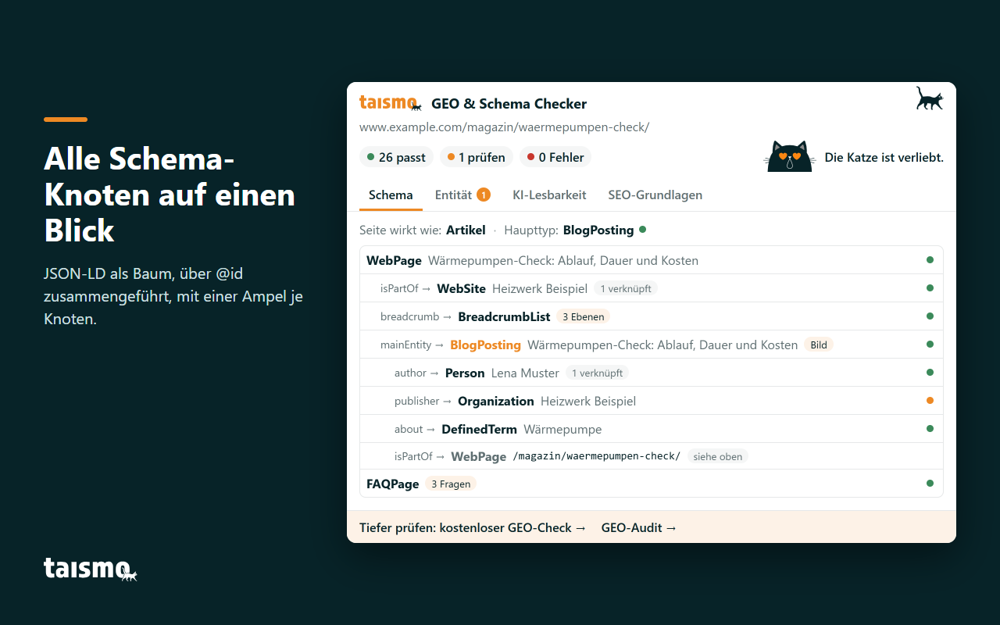
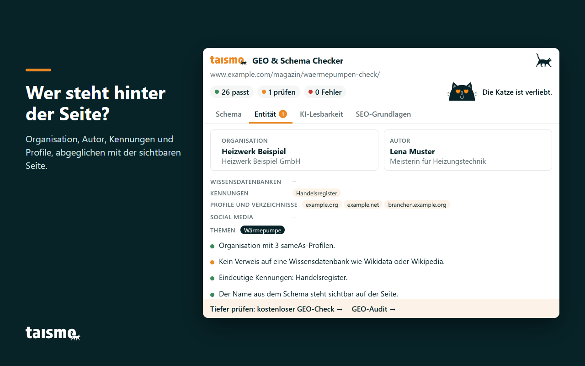
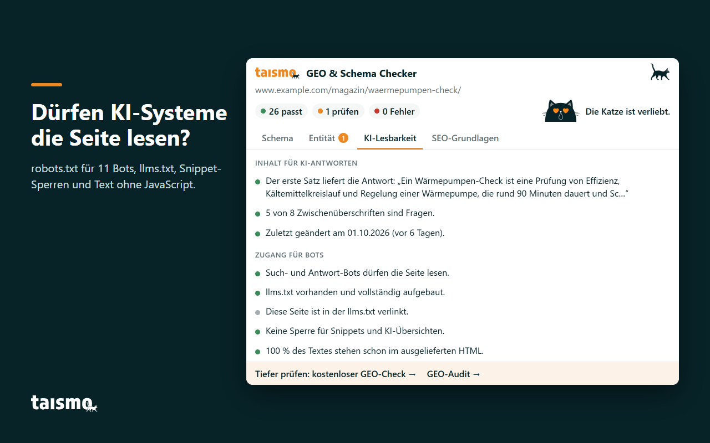
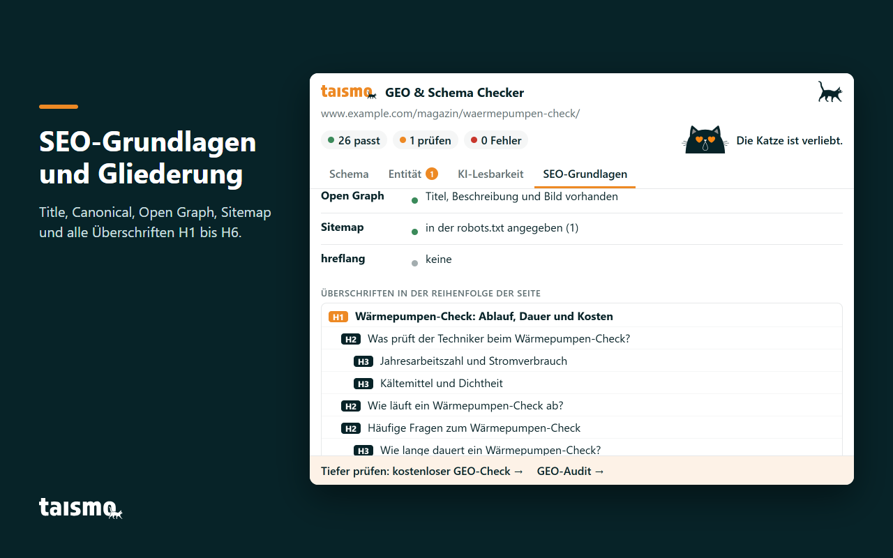
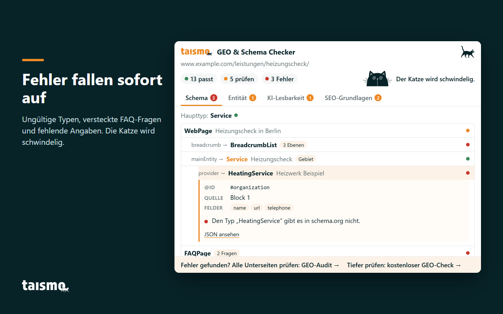

# GEO & Schema Checker by taismo

[English](README.md) · **Deutsch**

**Der GEO & Schema Checker by taismo ist eine kostenlose Chrome-Erweiterung, die mit einem Klick den Schema-Graphen, die Entitätssignale und die KI-Lesbarkeit jeder Webseite zeigt.** Sie liest das JSON-LD des offenen Tabs, führt es über `@id` so zusammen, wie Google es tut, und prüft, ob Suchmaschinen und KI-Crawler die Seite überhaupt lesen dürfen. Jede Prüfung läuft lokal in deinem Browser.

Die Erweiterung ist für SEOs, Entwickler und Redaktionen gemacht, die mit strukturierten Daten arbeiten und eine Seite so sehen wollen, wie Google, ChatGPT, Perplexity und andere KI-Systeme sie sehen. Entwickelt hat sie [taismo](https://taismo.de/), die SEO- und GEO-Agentur aus München. Der Code steht unter der MIT-Lizenz.

- Kostenlos, ohne Konto, ohne Anmeldung
- Vier Reiter: Schema, Entität, KI-Lesbarkeit, SEO-Grundlagen
- Jeder Befund mit Ampel in drei Stufen (passt, prüfen, Fehler)
- Nur zwei Berechtigungen: `activeTab` und `scripting`
- Keine Daten verlassen deinen Browser
- Oberfläche auf Deutsch und Englisch, je nach Browsersprache

**[Kostenlos im Chrome Web Store installieren](https://chromewebstore.google.com/detail/geo-schema-checker-by-tai/nmddlaafhlfldaiccalieibgelmdddgn)** · [Der GEO & Schema Checker auf taismo.de](https://taismo.de/schema-checker/)

## Was die Erweiterung prüft

Ein Klick auf die Katze in deiner Symbolleiste prüft die Seite im aktiven Tab. Das Popup zeigt die URL, drei Zähler (passt, prüfen, Fehler), ein Urteil der Katze und vier Reiter.

| Reiter | Frage |
|---|---|
| Schema | Welche strukturierten Daten hat die Seite, und passen sie zusammen? |
| Entität | Wer steht hinter der Seite? |
| KI-Lesbarkeit | Können KI-Systeme die Seite lesen und zitieren? |
| SEO-Grundlagen | Stimmen die Grundlagen? |

## Reiter Schema: Der JSON-LD-Graph, wie Google ihn zusammenführt

Theme, SEO-Plugin und ein handgeschriebenes Snippet liefern oft drei JSON-LD-Blöcke, die dieselbe Organisation, dieselbe Seite und dieselbe Breadcrumb beschreiben. Google führt Knoten mit derselben `@id` zu einer Entität zusammen. Genau diese zusammengeführte Sicht zeigt der Reiter Schema.

- **Graph als Baum.** Alle JSON-LD-Blöcke, auch `@graph`-Listen, werden über `@id` zusammengeführt und als Baum gezeigt, der bei der Seite beginnt. Jeder Knoten zeigt Typ, Namen, die verknüpfende Eigenschaft (`mainEntity`, `author`, `publisher`) und eine Ampel.
- **Haupttyp.** Die Erweiterung erkennt die Art der Seite (Startseite, Artikel, Glossar, Produkt) und den schema.org-Typ, der sie beschreibt. Ein Blogartikel, der nur als `WebPage` ausgezeichnet ist, fällt auf.
- **Gültige Typen.** Jeder `@type` wird mit dem vollständigen schema.org-Vokabular abgeglichen. Erfundene Typen wie `HeatingService` erscheinen als Fehler, weil Google sie ignoriert.
- **Pflichtangaben.** Artikel ohne `author`, `datePublished` oder `headline`, Breadcrumb-Ebenen ohne `item`, Produkte ohne `offers`, ein `LocalBusiness` ohne Adresse.
- **FAQ-Markup gegen sichtbaren Inhalt.** Jede Frage einer `FAQPage` wird mit dem Text der Seite abgeglichen.
- **Widersprüche.** Liefern zwei Quellen dieselbe Liste unter derselben `@id`, widersprechen sie sich; die Erweiterung nennt die beteiligten Blöcke.
- **Datum und Sprache.** ISO-8601-Datum mit Zeitzone und ein `inLanguage`, das zur Seite passt.
- **Schema per JavaScript.** Blöcke, die erst per JavaScript entstehen, bleiben für viele KI-Crawler unsichtbar. Die Erweiterung vergleicht dafür die gerenderte Seite mit dem ausgelieferten HTML.

Ein Klick auf einen Knoten zeigt seine `@id`, den Quell-Block und seine Felder. „JSON ansehen“ öffnet das rohe Markup mit Kopier-Knopf, und zwei Links übergeben die URL an den [Rich-Results-Test](https://search.google.com/test/rich-results) von Google und an den [Schema Markup Validator](https://validator.schema.org/). Die Grundlagen erklärt unser Wiki: [JSON-LD](https://taismo.de/was-ist/json-ld/), [schema.org](https://taismo.de/was-ist/schema-org/) und [strukturierte Daten](https://taismo.de/was-ist/strukturierte-daten/).

## Reiter Entität: Wer hinter der Seite steht

Suchmaschinen und Sprachmodelle ordnen jede Seite einer Entität zu, also dem Unternehmen oder der Person, die dafür verantwortlich ist. Kennungen, Profile und stimmige Angaben machen eine Entität eindeutig, dieselben Signale, die den [Knowledge Graph](https://taismo.de/was-ist/knowledge-graph/) von Google speisen. Der Reiter Entität sammelt sie aus der Seite selbst.

- **Organisation und Autor** als zwei Karten, entnommen aus dem Schema.
- **sameAs-Verweise in vier Gruppen:** Wissensdatenbanken (Wikidata, Wikipedia, DBpedia), Kennungen (ISNI, ORCID, VIAF, Deutsche Nationalbibliothek, Handelsregister, LEI), Profile und Verzeichnisse sowie Social Media.
- **Schema gegen sichtbare Seite.** Stehen Name, Telefonnummer und Adresse der Organisation aus dem Schema auch auf der Seite?
- **Autor.** Ist der Autor sichtbar, im Markup beschrieben und mit Profilen verknüpft?
- **Themen.** Welche Themen die Seite per `about` und `mentions` auszeichnet und ob sie auf eine Wissensdatenbank verweisen.

Alles davon stammt aus der Seite selbst, die Erweiterung fragt keinen fremden Dienst ab. Hintergrund: [Was ist eine Entität?](https://taismo.de/was-ist/entitaet/)

## Reiter KI-Lesbarkeit: Können KI-Systeme die Seite lesen und zitieren?

Generative Engine Optimization (GEO), im Englischen auch Answer Engine Optimization (AEO) oder AI Search Optimization genannt, beginnt mit einer technischen Frage: Darf ein KI-Crawler die Seite abrufen, und findet er den Inhalt im HTML?

**Inhalt für KI-Antworten**

- ob der erste Absatz nach der H1 mit einer direkten Antwort beginnt
- wie viele Zwischenüberschriften als Frage formuliert sind
- das letzte Änderungsdatum und ob ein sichtbares Datum zum Schema passt

**Zugang für Bots**

- `robots.txt` für 11 User Agents. Suche und KI-Antworten: Googlebot, Bingbot, OAI-SearchBot, ChatGPT-User, PerplexityBot, Claude-SearchBot. KI-Training: GPTBot, ClaudeBot, Google-Extended, Applebot-Extended, CCBot. Ein gesperrter Such-Bot zählt als Fehler, ein gesperrter Trainings-Bot als „prüfen“, weil die Sperre gewollt sein kann.
- `llms.txt`: Existiert die Datei, folgt sie dem [llms.txt-Vorschlag](https://llmstxt.org/), und verlinkt sie diese Seite?
- `nosnippet`, `max-snippet` und `data-nosnippet`, die begrenzen, was Google für KI-Übersichten verwenden darf, aus Meta-Tags und dem Header `X-Robots-Tag`.
- Der Anteil des Textes, der schon im ausgelieferten HTML steht. Text, der erst per JavaScript entsteht, bleibt für viele [KI-Crawler](https://taismo.de/was-ist/ki-crawler/) unsichtbar.

Mehr zum Format steht in unserem Wiki-Eintrag zur [llms.txt](https://taismo.de/was-ist/llms-txt/) und im [Praxis-Guide zur llms.txt](https://taismo.de/seo-magazin/llms-txt-praxis-guide/).

## Reiter SEO-Grundlagen: Title, Canonical und Gliederung

Der vierte Reiter zeigt die Grundlagen in einer Tabelle: Title und Meta Description mit ihrer Länge, H1, `lang`-Attribut, Canonical, Indexierung über Meta Robots und `X-Robots-Tag`, Open Graph, die Sitemap und ihren Eintrag in der `robots.txt` sowie `hreflang` samt `x-default`. Darunter stehen alle Überschriften von H1 bis H6 in der Reihenfolge der Seite; Überschriften in Navigation, Kopf oder Fuß sind markiert, übersprungene Ebenen werden gezählt.

## Das Katzen-Urteil

Die schwarze Katze von taismo sitzt im Popup und beurteilt das Ergebnis. Das Urteil ist ein Spaß aus den Zahlen der Ampel und trägt keine eigene Wertung.

| Urteil | Wann |
|---|---|
| Die Katze ist verliebt. | keine Fehler und wenige Punkte zum Prüfen |
| Die Katze schaut genauer hin. | mehrere Punkte zum Prüfen |
| Der Katze wird schwindelig. | mindestens ein Fehler |
| Hier kommt die Katze nicht rein. | Browser-Seiten, Chrome Web Store und PDF-Dateien lassen sich nicht prüfen |

Nach jeder Prüfung zeigt das Icon in der Symbolleiste das Gesicht der Katze für diesen Tab, die Zahl der Fehler steht als oranges Badge daneben. Eine neue Seite im Tab setzt das Icon zurück.

## Datenschutz: Alles bleibt in deinem Browser

Der GEO & Schema Checker hat keinen Server, kein Konto und keine Webanalyse.

- **Zwei Berechtigungen.** `activeTab` gibt erst dann Zugriff auf den aktuellen Tab, wenn du auf das Icon klickst, und `scripting` erlaubt der Erweiterung, diese Seite zu lesen. Es gibt keine Host-Berechtigungen und keinen Zugriff auf andere Tabs, deinen Verlauf oder deine Lesezeichen.
- **Keine Datenübertragung.** Nichts über die geprüfte Seite, dein Surfverhalten oder deine Einstellungen geht an taismo oder an Dritte.
- **Keine Cookies, kein Speicher.** Die Erweiterung setzt keine Cookies und speichert nichts.
- **Abrufe gehen an die geprüfte Website.** Die Erweiterung lädt die Seite noch einmal von derselben Website, mit der Sitzung, die dein Tab ohnehin hat, um das ausgelieferte HTML mit der gerenderten Seite zu vergleichen. Außerdem fragt sie dort `/robots.txt`, `/llms.txt`, `/sitemap.xml` und `/sitemap_index.xml` ab.
- **Logo aus dem Schema.** Nennt das Schema der Seite ein Logo, zeigt der Reiter Entität dieses Bild. Dein Browser lädt es von der Adresse, die im Schema steht; das kann auch ein anderer Server als die geprüfte Website sein.
- **Links öffnen sich nur per Klick.** Rich-Results-Test und Schema Markup Validator erhalten die URL der geprüften Seite erst beim Klick. Links auf taismo.de tragen UTM-Parameter, damit wir Besuche aus der Erweiterung in unserer eigenen Webanalyse zählen können.
- **Begrüßungs- und Feedbackseite.** `src/background.js` enthält eine Begrüßungsseite nach der Installation und eine Feedbackseite nach dem Entfernen, beide auf taismo.de. In Version 1.0.0 sind beide ausgeschaltet (`PAGES_LIVE = false`).

Jede dieser Aussagen lässt sich im Quellcode nachprüfen.

## Installation

### Aus dem Chrome Web Store

Die Erweiterung steht kostenlos im Chrome Web Store: **[GEO & Schema Checker by taismo installieren](https://chromewebstore.google.com/detail/geo-schema-checker-by-tai/nmddlaafhlfldaiccalieibgelmdddgn)**. Nach der Installation heftest du die Katze über das Puzzle-Symbol in der Symbolleiste an und klickst sie auf einer beliebigen Seite an. Mehr zur Erweiterung steht auf der [Seite zum GEO & Schema Checker](https://taismo.de/schema-checker/).

Browser auf Chromium-Basis wie Microsoft Edge, Brave, Opera und Vivaldi installieren Erweiterungen ebenfalls aus dem Chrome Web Store.

### Entpackte Erweiterung laden (für Entwickler)

1. Repository klonen: `git clone https://github.com/taismo-gmbh/geo-schema-checker.git`
2. `chrome://extensions` öffnen und oben rechts den **Entwicklermodus** einschalten.
3. **Entpackte Erweiterung laden** klicken und den geklonten Ordner wählen, also den Ordner mit der `manifest.json`.
4. Die Erweiterung über das Puzzle-Symbol in der Symbolleiste anheften.
5. Eine beliebige Website öffnen und auf die Katze klicken.

Nach Änderungen am Code klickst du in `chrome://extensions` beim Eintrag der Erweiterung auf den Pfeil zum Neuladen. Das englische Chrome-Tutorial [Hello World extension](https://developer.chrome.com/docs/extensions/get-started/tutorial/hello-world) beschreibt dieselben Schritte.

## Projektaufbau

Die Erweiterung besteht aus reinem JavaScript mit ES-Modulen auf Manifest V3. Es gibt keinen Build-Schritt und keine Abhängigkeiten: Der Ordner in diesem Repository ist die Erweiterung.

| Datei | Aufgabe |
|---|---|
| `manifest.json` | Manifest V3, Berechtigungen `activeTab` und `scripting` |
| `popup.html`, `popup.css` | das Popup (780 × 590 px) |
| `src/popup.js` | holt den aktiven Tab, schleust den Sammler ein, startet Bewertung und Darstellung |
| `src/collect.js` | läuft in der geprüften Seite und sammelt Rohdaten |
| `src/graph.js` | Schema-Graph (`@graph`, Zusammenführung über `@id`) und Baum |
| `src/rules.js` | Bewertung in drei Stufen (passt, prüfen, Fehler) |
| `src/entity.js` | Entitätssignale: Organisation, Autor, sameAs-Gruppen, Kennungen, Themen |
| `src/ui.js` | Reiter, Baum, Karten, Urteil und Status in der Symbolleiste |
| `src/i18n.js` | alle Texte der Oberfläche auf Deutsch und Englisch |
| `src/schema-types.js` | schema.org-Klassen für die Typprüfung |
| `src/background.js` | Service Worker, setzt das Icon beim Laden einer neuen Seite zurück |
| `_locales/` | Name und Beschreibung der Erweiterung |
| `assets/`, `icons/` | Logo, Katze, Gesichter für das Urteil und Icons für die Symbolleiste |
| `docs/screenshots/` | Screenshots einer Demo-Seite auf example.com |

Die Aufgaben sind bewusst getrennt: `collect.js` sammelt nur, `rules.js` und `entity.js` bewerten nur, `ui.js` stellt nur dar. Eine neue Prüfung betrifft meist `rules.js` und beide Sprachblöcke in `i18n.js`.

## Mitwirken und Issues

Fehlermeldungen und Ideen sind als [Issue](https://github.com/taismo-gmbh/geo-schema-checker/issues) willkommen, auf Deutsch oder Englisch. Eine hilfreiche Meldung enthält die URL der Seite (oder ein kleines HTML-Beispiel), was die Erweiterung anzeigt und was du erwartet hast, am besten mit Quelle wie der Definition auf schema.org oder der Dokumentation von Google. Fehlalarme sind besonders wertvoll.

Pull Requests nehmen wir gern an, wenn sie drei Grundsätze einhalten: Keine neuen Berechtigungen, keine Daten, die den Browser verlassen, und jeder neue Text in beiden Sprachen in `src/i18n.js`. Sicherheitslücken meldest du bitte vertraulich per E-Mail an info@taismo.de.

## Häufige Fragen

**Ist der GEO & Schema Checker kostenlos?**
Ja. Die Erweiterung ist kostenlos, braucht kein Konto und ist Open Source unter der MIT-Lizenz.

**Sendet die Erweiterung Daten an taismo oder an andere?**
Nein. Alle Prüfungen laufen lokal. Abrufe gehen an die Website, die du gerade prüfst, und an die Adresse des Logos, das diese Seite in ihrem Schema nennt.

**Ersetzt die Erweiterung den Rich-Results-Test von Google?**
Sie ergänzt ihn. Die Erweiterung zeigt mit einem Klick den ganzen Schema-Graphen samt Entitäts- und KI-Signalen; ob eine Seite für ein bestimmtes Rich Result infrage kommt, sagt dir der Rich-Results-Test, der im Reiter Schema verlinkt ist.

**Welche Browser werden unterstützt?**
Google Chrome und andere Browser auf Chromium-Basis wie Microsoft Edge, Brave, Opera und Vivaldi. Firefox und Safari unterstützt Version 1.0.0 nicht.

**Kann ich Seiten hinter einem Login, Staging-Umgebungen oder localhost prüfen?**
Ja. Die Erweiterung prüft die Seite, die im aktiven Tab offen ist, sofern sie über http oder https ausgeliefert wird.

**Warum wird der Katze schwindelig?**
Die Seite hat mindestens einen Fehler. Der Reiter mit dem roten Badge zeigt, welcher Befund das auslöst.

**Was ist GEO?**
Generative Engine Optimization (GEO) macht eine Website in KI-Antworten sichtbar, etwa in den KI-Übersichten und im KI-Modus von Google, bei ChatGPT, Gemini und Perplexity. Strukturierte Daten, eine klare Entität und der Zugang für Crawler bilden die technische Grundlage; mehr dazu in unserer [Erklärung zu Generative Engine Optimization](https://taismo.de/was-ist/generative-engine-optimization/).

## Über taismo

Die [taismo GmbH](https://taismo.de/) ist eine SEO- und GEO-Agentur aus München, gegründet 2019. Wir machen Unternehmen bei Google und in KI-Systemen sichtbar, über die ganze Breite der Suchmaschinenoptimierung: Strategie, Content, interne Struktur, Technik und strukturierte Daten. Wir arbeiten für Unternehmen mit umkämpftem Markt und erklärungsbedürftiger Leistung, mit Schwerpunkt B2B und Mittelstand.

Der [GEO & Schema Checker](https://taismo.de/schema-checker/) bringt Prüfungen in den Browser, die wir jeden Tag für unsere Kunden fahren. Wenn eine Seite nicht reicht:

- Der [kostenlose GEO-Check](https://taismo.de/seo-magazin/seo-und-geo-check/) prüft, ob eine URL in KI-Antworten zitiert werden kann.
- Das [GEO-Audit](https://taismo.de/geo-audit/) misst die KI-Sichtbarkeit einer ganzen Website, Unterseite für Unterseite.
- Unsere Leistungsseiten beschreiben die Arbeit als [GEO-Agentur](https://taismo.de/geo/) und die laufende [SEO-Betreuung](https://taismo.de/seo-betreuung/).

Außerdem pflegt taismo das [GEO-Handbuch für den deutschen Markt](https://github.com/taismo-gmbh/generative-engine-optimization-de), einen offenen Prüfkatalog mit Glossar.

**Kennungen:** ISNI der taismo GmbH [0000 0005 3161 3181](https://isni.org/isni/0000000531613181) · ORCID von Dominik Breitbach, Maintainer, [0009-0004-4460-2828](https://orcid.org/0009-0004-4460-2828)

## Lizenz und Zitierweise

Veröffentlicht unter der [MIT-Lizenz](LICENSE), Copyright (c) 2026 taismo GmbH. Du darfst den Code verwenden, ändern und weitergeben, auch kommerziell, solange der Copyright-Hinweis erhalten bleibt. Zum Zitieren in Forschung, Lehre oder Veröffentlichungen nutzt du die [CITATION.cff](CITATION.cff) oder den Knopf „Cite this repository“ auf GitHub.
