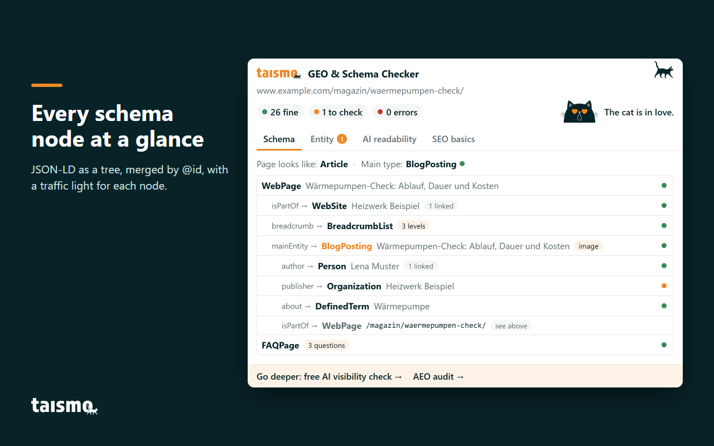
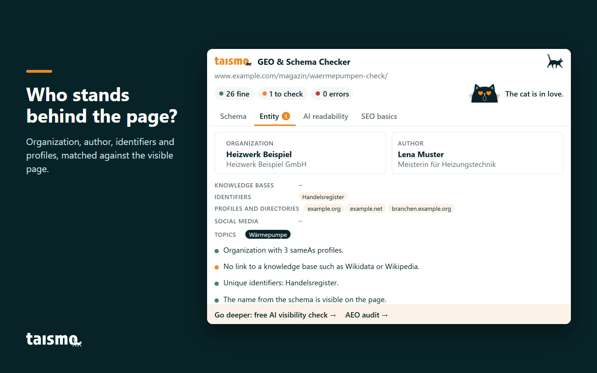
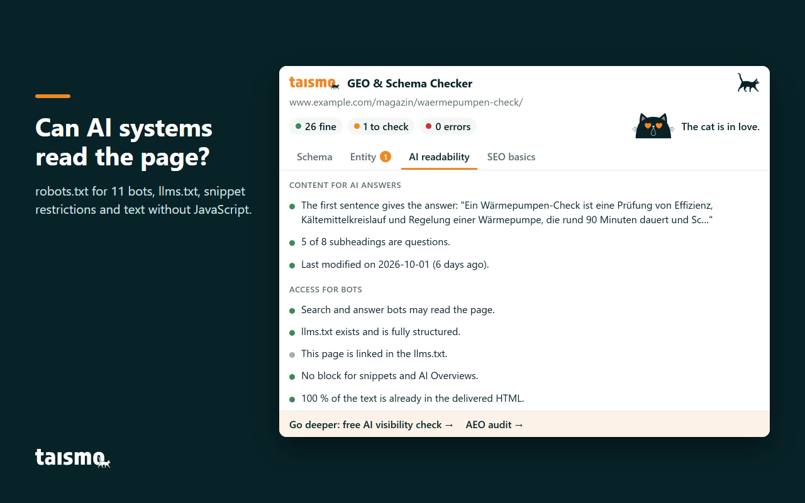
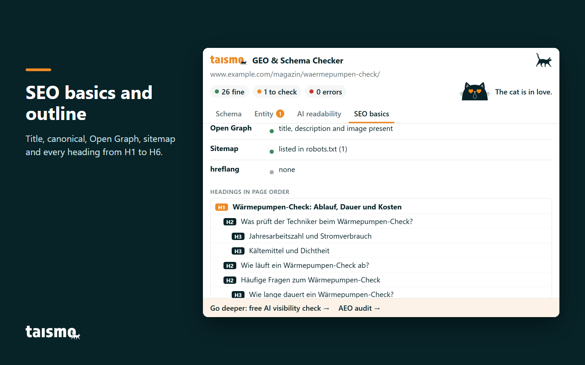
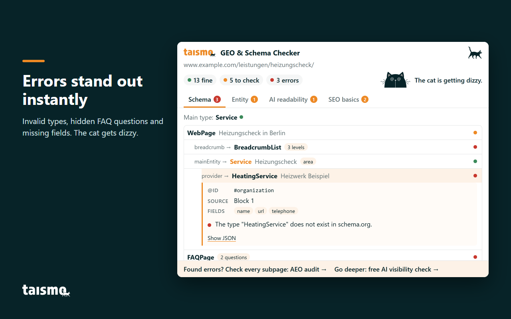

# GEO & Schema Checker by taismo

**English** · [Deutsch](README.de.md)

<!-- Landing page https://taismo.de/schema-checker/ (EN: https://taismo.de/en/schema-checker/) is not live yet. Link it here, in "Installation" and in "About taismo" on launch day. -->

**GEO & Schema Checker by taismo is a free Chrome extension that shows the schema graph, the entity signals and the AI readability of any web page in one click.** It reads the JSON-LD of the open tab, merges it by `@id` the way Google does, and checks whether search engines and AI crawlers may read the page at all. Every check runs locally in your browser.

The extension is made for SEOs, developers and content teams who work with structured data and want to see a page the way Google, ChatGPT, Perplexity and other AI systems see it. It is developed by [taismo](https://taismo.de/en/), an SEO and GEO agency from Munich, and published under the MIT License.

- Free, no account, no sign-up
- Four tabs: Schema, Entity, AI readability, SEO basics
- Every finding marked as fine, to check or error
- Two permissions only: `activeTab` and `scripting`
- No data leaves your browser
- Interface in English and German, following your browser language

## What the extension checks

One click on the cat in your toolbar checks the page in the active tab. The popup shows the URL, three counters (fine, to check, errors), a verdict from the cat and four tabs.

| Tab | Question it answers |
|---|---|
| Schema | Which structured data does the page have, and does it hold together? |
| Entity | Who stands behind the page? |
| AI readability | Can AI systems read and quote the page? |
| SEO basics | Are the fundamentals in place? |

## Schema tab: the JSON-LD graph as Google merges it

A theme, an SEO plugin and a hand-written snippet often deliver three JSON-LD blocks that describe the same organization, the same page and the same breadcrumb. Google combines nodes with the same `@id` into one entity, and the Schema tab shows exactly that combined view.

- **Graph as a tree.** All JSON-LD blocks, including `@graph` arrays, are merged by `@id` and shown as a tree that starts at the page. Each node shows its type, its name, the property that links it (`mainEntity`, `author`, `publisher`) and a traffic light.
- **Main type.** The extension recognizes the kind of page (homepage, article, glossary entry, product) and the schema.org type that describes it. A blog post marked up only as `WebPage` gets flagged.
- **Valid types.** Every `@type` is compared with the full schema.org vocabulary. Invented types such as `HeatingService` show up as errors, because Google ignores them.
- **Required fields.** Articles without `author`, `datePublished` or `headline`, breadcrumb levels without `item`, products without `offers`, a `LocalBusiness` without an address.
- **FAQ markup against visible content.** Every question in a `FAQPage` is matched with the text of the page.
- **Conflicts.** Two sources that define the same list under the same `@id` contradict each other, and the extension names the blocks that collide.
- **Dates and language.** ISO 8601 dates with a time zone, and an `inLanguage` that matches the page.
- **Schema created by JavaScript.** Blocks that only appear after JavaScript runs stay invisible to many AI crawlers. The extension compares the rendered page with the delivered HTML.

Click any node to see its `@id`, its source block and its fields. "Show JSON" opens the raw markup with a copy button, and two links pass the URL to Google's [Rich Results Test](https://search.google.com/test/rich-results) and the [Schema Markup Validator](https://validator.schema.org/). The basics are explained in our glossary: [JSON-LD](https://taismo.de/en/what-is/json-ld/) and [schema.org](https://taismo.de/en/what-is/schema-org/).

## Entity tab: who stands behind the page

Search engines and language models connect every page to an entity: the company or person responsible for it. Identifiers, profiles and consistent data make an entity unambiguous, the same signals that feed the Google [knowledge graph](https://taismo.de/en/what-is/knowledge-graph/). The Entity tab collects them from the page itself.

- **Organization and author** as two cards, taken from the schema.
- **sameAs links in four groups:** knowledge bases (Wikidata, Wikipedia, DBpedia), identifiers (ISNI, ORCID, VIAF, the German National Library, company registers, LEI), profiles and directories, and social media.
- **Schema against the visible page.** Do the organization's name, phone number and address from the schema appear on the page?
- **Author.** Is the author visible, described in the markup and linked to profiles?
- **Topics.** Which topics the page declares via `about` and `mentions`, and whether they point to a knowledge base.

All of this comes from the page itself. The extension queries no external service. Background: [what an entity is](https://taismo.de/en/what-is/entity/).

## AI readability tab: can AI systems read and quote the page

Generative engine optimization (GEO), also called answer engine optimization (AEO) or AI search optimization, starts with a technical question: may an AI crawler fetch the page, and does it find the content in the HTML?

**Content for AI answers**

- whether the first paragraph after the H1 opens with a direct answer
- how many subheadings are phrased as questions
- the last modification date, and whether a visible date matches the schema

**Access for bots**

- `robots.txt` for 11 user agents. Search and AI answers: Googlebot, Bingbot, OAI-SearchBot, ChatGPT-User, PerplexityBot, Claude-SearchBot. AI training: GPTBot, ClaudeBot, Google-Extended, Applebot-Extended, CCBot. A blocked search bot counts as an error, a blocked training bot as "to check", because that block may be intended.
- `llms.txt`: Does the file exist, does it follow the [llms.txt proposal](https://llmstxt.org/), and does it link this page?
- `nosnippet`, `max-snippet` and `data-nosnippet`, which limit what Google may use in AI Overviews, from meta tags and the `X-Robots-Tag` header.
- The share of text already present in the delivered HTML. Text that only JavaScript creates often stays invisible to [AI crawlers](https://taismo.de/en/what-is/ai-crawler/).

More on the format: our glossary entry on [llms.txt](https://taismo.de/en/what-is/llms-txt/) and the [practical llms.txt guide](https://taismo.de/en/seo-magazine/llms-txt-guide/).

## SEO basics tab: title, canonical and outline

The fourth tab lists the fundamentals in one table: title and meta description with their length, H1, `lang` attribute, canonical, indexing via meta robots and `X-Robots-Tag`, Open Graph, the sitemap and its entry in `robots.txt`, and `hreflang` including `x-default`. Below, every heading from H1 to H6 appears in page order, with headings in navigation, header or footer marked and skipped levels counted.

## The cat verdict

taismo's black cat sits in the popup and judges the result. The verdict is a joke built from the traffic light counts and carries no score of its own.

| Verdict | When |
|---|---|
| The cat is in love. | no errors and few points to check |
| The cat takes a closer look. | several points to check |
| The cat is getting dizzy. | at least one error |
| The cat cannot get in here. | browser pages, the Chrome Web Store and PDF files cannot be checked |

After each check, the toolbar icon shows the cat's face for that tab, with the number of errors as an orange badge. A new page in the tab resets the icon.

## Privacy: everything stays in your browser

The GEO & Schema Checker has no server, no account and no analytics.

- **Two permissions.** `activeTab` grants access to the current tab only after you click the icon, and `scripting` lets the extension read that page. There are no host permissions and no access to other tabs, your history or your bookmarks.
- **No data transfer.** Nothing about the checked page, your browsing or your settings is sent to taismo or to third parties.
- **No cookies, no storage.** The extension sets no cookies and stores nothing.
- **Requests go only to the checked website.** The extension loads the page once more from the same site, with the session your tab already has, to compare the delivered HTML with the rendered page. It also requests `/robots.txt`, `/llms.txt`, `/sitemap.xml` and `/sitemap_index.xml` from that site.
- **Links open only when you click them.** The Rich Results Test and the Schema Markup Validator receive the URL of the checked page on click. Links to taismo.de carry UTM parameters, so we can count visits from the extension in our own web analytics.
- **Welcome and feedback page.** `src/background.js` contains a welcome page after installation and a feedback page after removal, both on taismo.de. Both are switched off in version 1.0.0 (`PAGES_LIVE = false`).

Every statement can be verified in the source code.

## Installation

### From the Chrome Web Store

<!-- Replace the placeholder below with the Chrome Web Store link on launch day. -->

> **Chrome Web Store: link follows at launch.** The extension is in review. Until then, load it as an unpacked extension.

Chromium-based browsers such as Microsoft Edge, Brave, Opera and Vivaldi can install extensions from the Chrome Web Store as well.

### Load the unpacked extension (for developers)

1. Clone the repository: `git clone https://github.com/taismo-gmbh/geo-schema-checker.git`
2. Open `chrome://extensions` and switch on **Developer mode** in the top right corner.
3. Click **Load unpacked** and select the cloned folder, the one that contains `manifest.json`.
4. Pin the extension via the puzzle icon in the toolbar.
5. Open any website and click the cat.

After changing the code, click the reload arrow on the extension's card in `chrome://extensions`. Chrome's tutorial [Hello World extension](https://developer.chrome.com/docs/extensions/get-started/tutorial/hello-world) walks through the same steps.

## Project structure

The extension is plain JavaScript with ES modules on Manifest V3. There is no build step and there are no dependencies: the folder in this repository is the extension.

| File | Purpose |
|---|---|
| `manifest.json` | Manifest V3, permissions `activeTab` and `scripting` |
| `popup.html`, `popup.css` | the popup (780 × 590 px) |
| `src/popup.js` | finds the active tab, injects the collector, starts evaluation and rendering |
| `src/collect.js` | runs inside the checked page and collects raw data |
| `src/graph.js` | schema graph (`@graph`, merging by `@id`) and tree |
| `src/rules.js` | evaluation in three levels: fine, to check, error |
| `src/entity.js` | entity signals: organization, author, sameAs groups, identifiers, topics |
| `src/ui.js` | tabs, tree, cards, verdict and toolbar state |
| `src/i18n.js` | all interface texts in English and German |
| `src/schema-types.js` | schema.org classes for type validation |
| `src/background.js` | service worker, resets the toolbar icon on page load |
| `_locales/` | extension name and description |
| `assets/`, `icons/` | logo, cat, verdict faces and toolbar icons |
| `docs/screenshots/` | screenshots of a demo page on example.com |

The roles are separated on purpose: `collect.js` only gathers, `rules.js` and `entity.js` only judge, `ui.js` only renders. A new check usually touches `rules.js` and both language blocks in `i18n.js`.

## Contributing and issues

Bug reports and ideas are welcome as [issues](https://github.com/taismo-gmbh/geo-schema-checker/issues). A helpful report contains the URL of the page (or a minimal HTML example), what the extension shows, and what you expected, ideally with a source such as the schema.org definition or Google's documentation. False positives are especially valuable.

Pull requests are welcome when they follow three principles: no new permissions, no data leaving the browser, and every new text in both languages in `src/i18n.js`. Please report security issues privately by email to info@taismo.de.

## FAQ

**Is the GEO & Schema Checker free?**
Yes. The extension is free, needs no account and is open source under the MIT License.

**Does the extension send data to taismo or anyone else?**
No. All checks run locally, and the only network requests go to the website you are checking.

**Does it replace Google's Rich Results Test?**
It complements it. The extension shows the whole schema graph plus entity and AI signals in one click; the Rich Results Test, linked in the Schema tab, tells you whether a page qualifies for a specific rich result.

**Which browsers are supported?**
Google Chrome and other Chromium-based browsers such as Microsoft Edge, Brave, Opera and Vivaldi. Firefox and Safari are not supported in version 1.0.0.

**Can I check pages behind a login, staging sites or localhost?**
Yes. The extension checks whatever page is open in the active tab, as long as it is served over http or https.

**Why is the cat dizzy?**
The page has at least one error. The tab with the red badge shows which finding causes it.

**What is GEO?**
Generative engine optimization (GEO) makes a website visible in AI answers from Google AI Overviews, AI Mode, ChatGPT, Gemini and Perplexity. Structured data, a clear entity and crawler access form its technical foundation, explained in our [introduction to generative engine optimization](https://taismo.de/en/what-is/generative-engine-optimization/).

## About taismo

[taismo GmbH](https://taismo.de/en/) is an SEO and GEO agency from Munich, founded in 2019. We make companies visible on Google and in AI systems across the full breadth of search engine optimization: strategy, content, internal structure, technology and structured data. Our focus is B2B and mid-sized businesses in competitive markets whose services need explaining.

The GEO & Schema Checker puts checks we run for clients every day into the browser. When one page is not enough:

- The [free AI Visibility Checker](https://taismo.de/en/seo-magazine/seo-and-geo-check/) tests whether a URL can be cited in AI answers.
- The [GEO audit](https://taismo.de/en/geo-audit/) measures the AI visibility of a whole website, subpage by subpage.
- Our service page on [generative engine optimization](https://taismo.de/en/geo/) explains how we work on AI visibility.

taismo also maintains [generative-engine-optimization-de](https://github.com/taismo-gmbh/generative-engine-optimization-de), an open GEO handbook for the German market.

**Identifiers:** ISNI of taismo GmbH [0000 0005 3161 3181](https://isni.org/isni/0000000531613181) · ORCID of Dominik Breitbach, maintainer, [0009-0004-4460-2828](https://orcid.org/0009-0004-4460-2828)

## License and citation

Released under the [MIT License](LICENSE), Copyright (c) 2026 taismo GmbH. You may use, change and distribute the code, also commercially, as long as the copyright notice stays in place. To cite the extension in research, teaching or publications, use [CITATION.cff](CITATION.cff) or the "Cite this repository" button on GitHub.
